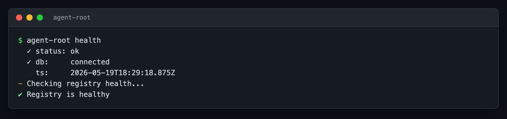
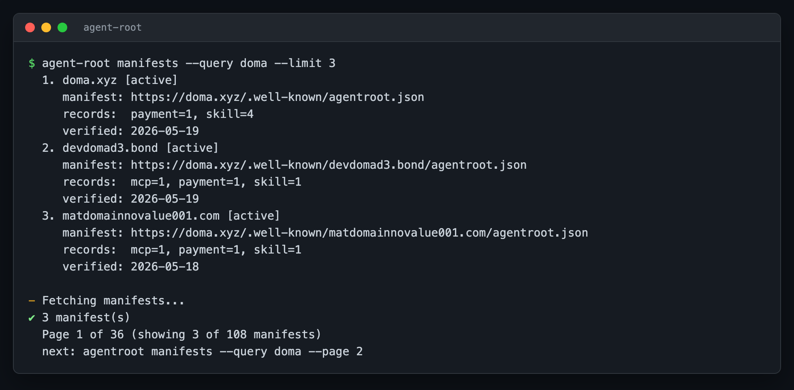
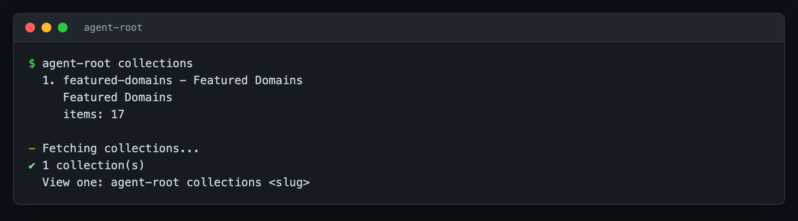

# agent-root

[](https://www.npmjs.com/package/agent-root)
[](LICENSE)
[](https://nodejs.org/)
[](https://github.com/d3-inc/agentroot/actions/workflows/ci.yml)

The command-line client for the **AgentRoot protocol**. Resolve domains, search the public registry, install skills, MCP servers, and agents into Claude, Cursor, Codex, Gemini, or any AgentRoot-aware tool.


## Table of contents

- [What is AgentRoot?](#what-is-agentroot)
- [What you can do with this CLI](#what-you-can-do-with-this-cli)
- [Install](#install)
- [Help](#help)
- [Usage](#usage)
  - [Discover what a domain publishes](#discover-what-a-domain-publishes)
  - [Search the registry](#search-the-registry)
  - [Install a skill into your project](#install-a-skill-into-your-project)
  - [Manage what you have installed](#manage-what-you-have-installed)
  - [Publish your own manifest](#publish-your-own-manifest)
  - [Browse and health-check the registry](#browse-and-health-check-the-registry)
- [How it works](#how-it-works)
  - [Exit codes](#exit-codes)
- [Configuration](#configuration)
- [Documentation](#documentation)
- [Contributing](#contributing)
- [License](#license)

## What is AgentRoot?

AgentRoot is a discovery protocol for AI capabilities, modeled on DNS. Any domain owner can publish four kinds of records:

| Record type | Purpose |
|---|---|
| `skill` | Markdown `SKILL.md` files that teach AI assistants how to perform a task. Think "buy a domain on Doma marketplace", "register a domain", "generate an invoice in Stripe". |
| `mcp` | Model Context Protocol server endpoints that expose tools and resources to AI agents. |
| `agent` | HTTP endpoints that respond to natural-language requests. |
| `a2a` | Agent-to-agent communication endpoints for multi-agent workflows. |

Publication happens entirely through DNS. A domain owner creates one TXT record:

```text
_agentroot.example.com  TXT  "v=ar1 manifest=https://example.com/.well-known/agentroot.json"
```

That TXT record points to a JSON manifest listing the records the domain offers. No central authority, no API keys, no gatekeeping; anyone with a domain can publish, anyone with a DNS client can discover.

The protocol specification and public registry live at [agentroot.io](https://agentroot.io).

## What you can do with this CLI

| You want to | Command | What happens |
|---|---|---|
| Look up a domain's AI capabilities | `agent-root resolve <domain>` | DNS lookup, manifest fetch, list of records |
| Search across every registered domain | `agent-root search <query>` | Ranked results from the public registry |
| Install a skill into your AI tool | `agent-root install <domain>/<recordId>` | `SKILL.md` plus supporting files materialized in your tool's directory |
| List what you have installed | `agent-root list` | Per-record breakdown with tool-specific paths |
| Update a previously installed skill | `agent-root update <domain>/<recordId>` | Re-fetches if upstream changed |
| Remove an installed skill | `agent-root uninstall <domain>/<recordId>` | Files removed, registry entry cleared |
| Scaffold a new manifest to publish | `agent-root init --domain <yours>` | `.well-known/agentroot.json` template written |
| Validate a manifest before publishing | `agent-root validate <file>` | "valid" or a list of specific errors |
| Submit a domain to the public registry | `agent-root submit <domain>` | Triggers DNS verification and indexing |
| Confirm the registry is up | `agent-root health` | `status: ok`, `db: connected`, exits non-zero if not |
| Browse every registered manifest | `agent-root manifests` | Paginated list with domain, manifest URL, record counts |
| Browse curated collections | `agent-root collections` | List collections or open one by slug |
| Inspect or change CLI configuration | `agent-root config get` / `set` | Current settings |

## Install

```bash
# One-off, no install required
npx agent-root <command>

# Or install globally
npm install -g agent-root

# Verify
agent-root help
```

Requires Node.js 18 or later. Works on macOS, Linux, and Windows.

## Help

Full help, available with `agent-root help`:


```text
USAGE
  npx agent-root <command> [options]

DISCOVER
  resolve  <domain>[/<record-id>]  DNS lookup, fetch manifest, show records
  search   <query>                  Search the AgentRoot registry

INSTALL
  install   <domain>/<record-id>    Install a record (skill or MCP)
  list                              Show installed records
  update    <domain>/<record-id>    Re-fetch from source
  uninstall <record-id>             Remove an installed record

PUBLISH
  init     [path]                   Scaffold a manifest
  validate [path]                   Validate a manifest
  submit   <domain>                 Submit a domain to the public registry

REGISTRY
  health                            Probe the registry API
  manifests [--query <q>]           List registered manifests (paginated)
  collections [<slug>]              Browse curated collections

TOOLING
  version                           Print version + runtime + config info
  completion <shell>                Print shell completion (bash, zsh, fish, pwsh)

OPTIONS
  --help, -h         Show this help
  --version, -v      Print CLI version (one line)
  --tool <name>      Target tool: claude, codex, gemini, cursor, agents
  --type <type>      Filter by record type: agent, mcp, skill, a2a, payment
  --project          Install to project directory (not global)
  --all              Install all records (or fetch every search/manifests page)
  --page <N>         Page number for search/manifests (1-indexed, default 1)
  --limit <N>        Per-page limit (1..100, default 20)
  --json, -j         Output as JSON
  --domain <name>    Domain name for init template
  --query <q>        Free-text filter for manifests
  --manifest-url     Explicit manifest URL for submit
  --yes, -y          Auto-confirm all prompts (for CI/scripts)
  --force, -f        Overwrite existing files
  --quiet, -q        Suppress non-essential output (spinners + notes)
  --no-install       Skip auto-install when resolving skill= records
  --no-color         Disable ANSI color (also auto-off in non-TTY)
```

Flag names accept kebab-case (`--manifest-url`) or camelCase (`--manifestUrl`); use `--key=value` or `--key value`. Pass `--` to stop option parsing.

All spinners, progress notes, and chatter go to **stderr**. Data and JSON output go to **stdout**. That means `agent-root <cmd> --json | jq .` works without `2>/dev/null`; pipes never carry color codes or progress lines.

Run `agent-root <command> --help` for per-command flags, examples, and [exit codes](#exit-codes).

If you typo a command, the CLI suggests the closest match:

```text
$ agent-root reslove doma.xyz
error Unknown command: reslove
       Did you mean: agentroot resolve?
```

### Version & environment

For bug reports, paste `agent-root version`:

```text
agent-root 0.2.0
node v22.14.0
os   darwin/arm64
api  https://www.agentroot.io
config /Users/you/.agentroot/config.json
```

`agent-root --version` (or `-v`) prints just the version on one line, matching `node --version` / `npm --version`.

## Usage

### Discover what a domain publishes

```bash
agent-root resolve doma.xyz
```

```text
✔ Found 5 record(s) at doma.xyz

  Doma Protocol (Skill)
  address: doma.xyz/doma-protocol
  desc:    Trade tokens, bridge assets, manage DNS records and nameservers, ...
  skill_md: https://doma.xyz/.agents/skills/doma-protocol/SKILL.md

  Doma MPP Domain Registration (Skill)
  address: doma.xyz/doma-mpp
  desc:    Register domains via the Doma MPP API using the Machine Payments ...
  ...
```

Resolve a specific record by adding the record ID:

```bash
agent-root resolve doma.xyz/doma-protocol
```

Use `--json` for machine-readable output:

```bash
agent-root resolve doma.xyz --json | jq '.records[].address'
```

### Search the registry

Search hits the public registry, which indexes domains submitted at [agentroot.io/submit](https://agentroot.io/submit).

```bash
agent-root search doma
agent-root search "register domain" --type skill
agent-root search marketplace --type agent
```


Results are paginated (20 per page). Use `--all` to fetch every page in one shot (capped at 1000 results):

```bash
agent-root search doma --page 2 --limit 50
agent-root search doma --all --type skill
```

For scripting, `--json` returns the full envelope (`results`, `total`, `page`, `pages`, `limit`):

```bash
agent-root search doma --json | jq -r '.results[] | select(.type=="skill") | .address'
agent-root search doma --json | jq '.total, .pages'
```

### Install a skill into your project

Point `--tool` at your AI assistant; the CLI fetches `SKILL.md` plus its supporting files into the directory your tool reads from.

```bash
cd your-project
agent-root install doma.xyz/doma-protocol --tool agents --project
```


#### Supported AI tools

`--tool` accepts:

| Value | Install location (global) | Install location (`--project`) |
|---|---|---|
| `claude` | `~/.claude/skills/` | `.claude/skills/` |
| `cursor` | `~/.cursor/skills/` | `.cursor/skills/` |
| `codex` | `~/.codex/skills/` | `.codex/skills/` |
| `gemini` | `~/.gemini/skills/` | `.gemini/skills/` |
| `agents` | `~/.agents/skills/` | `.agents/skills/` |

`agents` (the default) is a single install any AgentRoot-aware tool will pick up; tool-specific values scope to one tool.

#### Project vs user install

| Flag | Where files go | When to use |
|---|---|---|
| (no flag) | Your home directory's tool folder | Skills you want available in every project |
| `--project` | The current directory's tool folder | Skills you want versioned with one specific project |

#### Installing every record from a domain

```bash
agent-root install doma.xyz --all --tool agents
```

#### Discovering and installing in one flow

```bash
# Step 1: search
agent-root search "domain registration" --type skill

# Step 2: install the one you want
agent-root install doma.xyz/doma-mpp --tool claude --project

# Step 3: confirm
agent-root list
```

`agent-root search` interactively (without `--json` and inside a TTY) also offers an "install this record?" prompt at the end.

### Manage what you have installed

```bash
agent-root list
agent-root list --json
```

`list` reads `~/.agentroot/installed.json` and prints every installed record with its tool-specific paths:


Pipe to `less` for long lists, or `--json | jq` to filter.

Re-fetch a record (when the publisher updated the SKILL.md):

```bash
agent-root update doma.xyz/doma-protocol
```

To remove a record:

```bash
agent-root uninstall doma.xyz/doma-protocol --yes
```


`--yes` skips the confirmation prompt.

### Publish your own manifest

#### 1. Scaffold a manifest

```bash
agent-root init --domain mycompany.com
```

Writes `.well-known/agentroot.json` with a starter record. Schema: [agentroot.io/docs/protocol](https://agentroot.io/docs/protocol).


#### 2. Validate before serving

```bash
agent-root validate .well-known/agentroot.json
```


If validation fails, the error identifies the offending record and field:

```text
invalid agentroot.json

  - records[1]: mcp record missing "transport"
```

#### 3. Add the DNS TXT record

On your DNS provider, create:

```text
_agentroot.mycompany.com  TXT  "v=ar1 manifest=https://mycompany.com/.well-known/agentroot.json"
```

Serve the JSON at the URL above. Any AgentRoot client resolving `mycompany.com` will now discover your records.

#### 4. Submit to the public registry

Once DNS is live, register the domain so it shows up in `agent-root search`:

```bash
agent-root submit mycompany.com
```

The CLI does a local DNS probe, then posts to `/api/submit`. If the registry verifies the TXT record, it indexes the manifest and reports what it found:

```text
✔ Found and indexed: _agentroot, _skill records for mycompany.com

  manifest: https://mycompany.com/.well-known/agentroot.json
  indexed:  5 record(s)
  found:    _agentroot, _skill
```

If DNS isn't set up, `submit` prints the exact TXT record to add and exits non-zero:

```text
✖ No _agentroot TXT record found for mycompany.com

  Add this DNS TXT record, then re-submit:

    host:  _agentroot.mycompany.com
    type:  TXT
    value: v=ar1 manifest=https://mycompany.com/.well-known/agentroot.json
```

`--manifest-url` skips the DNS probe and submits a known URL directly. `--json` returns the structured response (validation errors, instructions block, indexed records).

### Browse and health-check the registry

#### Health check

```bash
agent-root health
```



Exits non-zero if the registry is unreachable, so it works as a CI gate:

```bash
agent-root health && deploy
```

#### Browse every registered manifest

`agent-root manifests` walks `/api/manifests` with the same pagination flags as `search`:

```bash
agent-root manifests --query doma
agent-root manifests --page 2 --limit 50
agent-root manifests --all --type mcp
```



Each row: domain, verification status, manifest URL, records by type, last verified date.

```text
  1. doma.xyz [active]
     manifest: https://doma.xyz/.well-known/agentroot.json
     records:  payment=1, skill=4
     verified: 2026-05-19

  Page 1 of 280 (showing 5 of 1399 manifests)
  next: agentroot manifests --query doma --page 2
```

#### Curated collections

The registry publishes editorial collections (e.g. `featured-domains`):

```bash
agent-root collections
agent-root collections featured-domains
```



Both forms accept `--json` for scripting.

## How it works

`agent-root` is DNS-first. It speaks the protocol directly, without depending on any central registry.

**When you run `agent-root resolve example.com`:**

1. The CLI issues a DNS TXT query for `_agentroot.example.com`
2. It parses the returned TXT record for the `manifest=...` URL
3. It fetches the manifest JSON over HTTPS
4. It parses each record and lists it

**When you run `agent-root install example.com/some-skill`:**

1. Steps 1 to 3 above (or a fallback to the registry API if DNS fails)
2. For the named record, fetches `SKILL.md` and its supporting files (relative URLs resolved against the SKILL.md location)
3. Files written to a canonical store at `~/.agents/skills/<domain>/<record-id>/`
4. For each `--tool`, a symlink (or copy with `--project`) is created in that tool's expected location

**When you run `agent-root search query`:** the CLI hits `/api/records` with the query, type filter, page, and limit. If page 1 is empty it falls back to `/api/find-skills` (legacy, skill-only); if still nothing and the query is a bare keyword, it treats it as a domain by appending `.io` then `.com`.

The public registry at [agentroot.io](https://agentroot.io) is a convenience for `search`, `health`, `manifests`, `collections`, and `submit`, not a dependency. `resolve`, `install`, `update`, and `uninstall` work even if the registry is offline because they go through DNS.

### Exit codes

Sysexits-style exit codes so scripts can branch on failure mode. Source: [`man 3 sysexits`](https://man.freebsd.org/cgi/man.cgi?query=sysexits).

| Code | Name | Meaning |
|---|---|---|
| `0` | `OK` | Success |
| `1` | `GENERIC` | Unspecified error |
| `2` | `USAGE` | Bad CLI arguments (missing positional, unknown command, conflicting flags) |
| `66` | `NOINPUT` | File not found (`validate /nonexistent`, `init` without `--force` when file exists) |
| `68` | `NOHOST` | DNS lookup failed, no `_agentroot` TXT record, domain not in registry |
| `69` | `UNAVAILABLE` | Registry unreachable, manifest fetch failed, network 5xx |
| `76` | `PROTOCOL` | Manifest validation failed against the protocol schema |
| `77` | `NOPERM` | Permission denied writing to `~/.agentroot` or `~/.claude/skills` |
| `78` | `CONFIG` | Configuration error (installed record missing source_url, corrupted state) |

Errors print one line to stderr (`error <msg>`) plus a one-line hint indented underneath. In `--json` mode the same data is emitted as a single envelope on stdout with the same exit code, so scripts can branch on `jq '.error.code'` and `$?` together (they always agree):

```bash
$ agent-root resolve nonexistent.test --json
{
  "error": {
    "code": "NOHOST",
    "message": "No _agentroot.nonexistent.test TXT record found",
    "hint": "Try: agentroot search nonexistent"
  }
}
$ echo $?
68
```

For per-command exit-code tables, run `agent-root <command> --help`.

## Configuration

Configuration lives at `~/.agentroot/config.json`. Inspect or change it with:

```bash
agent-root config get
agent-root config set api-url https://www.agentroot.io
```

Or override the API base via `AGENTROOT_API_BASE`:

```bash
AGENTROOT_API_BASE=https://my-mirror.example.com agent-root search billing
```

### Environment variables

The CLI reads the following environment variables (precedence: explicit flag > namespaced env > standard env > `CI` default):

| Variable | Effect |
|---|---|
| `NO_COLOR=1` | Disable ANSI color ([no-color.org](https://no-color.org)) |
| `FORCE_COLOR=0` | Disable ANSI color (Node convention) |
| `CI=true` | Imply `--yes` and `--no-color` (no prompts, plain text; matches `gh`, `pnpm`, `biome`) |
| `AGENTROOT_YES=1` | Imply `--yes` (skip all confirmation prompts) |
| `AGENTROOT_JSON=1` | Imply `--json` (machine-readable output) |
| `AGENTROOT_NO_COLOR=1` | Imply `--no-color` (namespaced variant) |
| `AGENTROOT_API_BASE=<url>` | Override the registry API base |

Example: `CI=true agent-root install foo --no-yes` still prompts, because `--no-yes` was typed.

No API key is required. The endpoints the CLI calls are public-read (`/api/records`, `/api/manifests`, `/api/manifests/{domain}`, `/api/find-skills`, `/api/health`, `/api/collections`, `/api/collections/{slug}`) plus one public-write (`/api/submit`, which the registry verifies via DNS before indexing).

### Shell completion

`agent-root completion <shell>` prints a completion script to stdout. Redirect to where your shell loads on startup:

```bash
# bash
agent-root completion bash > /usr/local/etc/bash_completion.d/agent-root
# or source it on every shell start:
echo 'source <(agent-root completion bash)' >> ~/.bashrc

# zsh
agent-root completion zsh > "${fpath[1]}/_agent-root"
# then reload with `compinit` (restarting the shell also works)

# fish
agent-root completion fish > ~/.config/fish/completions/agent-root.fish

# PowerShell
agent-root completion pwsh > $PROFILE.CurrentUserAllHosts/agent-root.ps1
```

Completes commands, flags, and `--tool` / `--type` value enums.

## Documentation

| What you need | Where it lives |
|---|---|
| Protocol spec | [agentroot.io/docs/protocol](https://agentroot.io/docs/protocol) |
| Contributing guide (fork + PR flow, dev setup, tests, triage) | [.github/CONTRIBUTING.md](.github/CONTRIBUTING.md) |
| Code of Conduct | [.github/CODE_OF_CONDUCT.md](.github/CODE_OF_CONDUCT.md) |
| Security policy + private vuln reporting | [.github/SECURITY.md](.github/SECURITY.md) |
| Support channels (bug? feature? question?) | [.github/SUPPORT.md](.github/SUPPORT.md) |
| Project governance (roles, decisions, lead, conflict resolution) | [GOVERNANCE.md](GOVERNANCE.md) |
| Current and emeritus maintainers | [MAINTAINERS.md](MAINTAINERS.md) |
| Smoke-test recipe + manual verification | [docs/TESTING.md](docs/TESTING.md) |
| Release notes | [CHANGELOG.md](CHANGELOG.md) |
| AI-assistant project conventions | [CLAUDE.md](CLAUDE.md) |

Source layout is in [CLAUDE.md](CLAUDE.md#project-layout).

## Contributing

Bug reports, fixes, docs, new commands, flags, and tool integrations all welcome.

- **Bug or feature**: use the [bug report](.github/ISSUE_TEMPLATE/bug_report.yml) or [feature request](.github/ISSUE_TEMPLATE/feature_request.yml) template; first-response within ~7 days.
- **Question**: open a [Discussion](https://github.com/d3-inc/agentroot/discussions) (once enabled). Best-effort, no SLA.
- **Code change**: fork, branch, PR against `main`. Full flow in [.github/CONTRIBUTING.md](.github/CONTRIBUTING.md).
- **Reading the code**: [CLAUDE.md](CLAUDE.md) covers file ordering, exit codes, streams, single source of truth.
- **Find something to work on**: filter issues by `good first issue` or `help wanted`.

See [GOVERNANCE.md](GOVERNANCE.md) for decision-making and how maintainers are added.

## License

[MIT](LICENSE) © D3 Inc and AgentRoot contributors.
