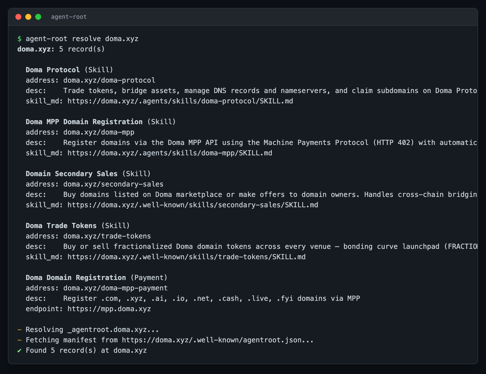
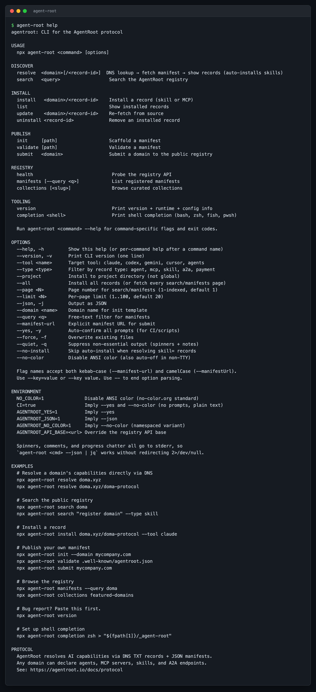
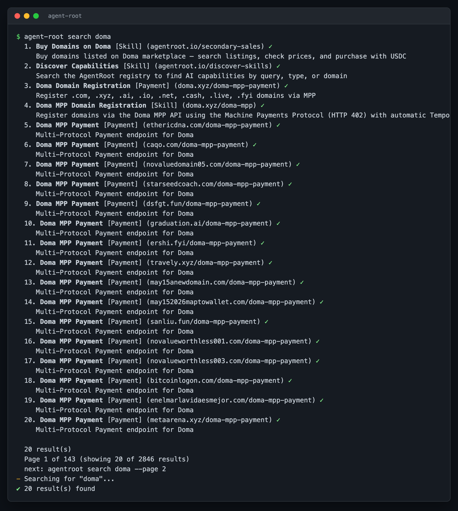
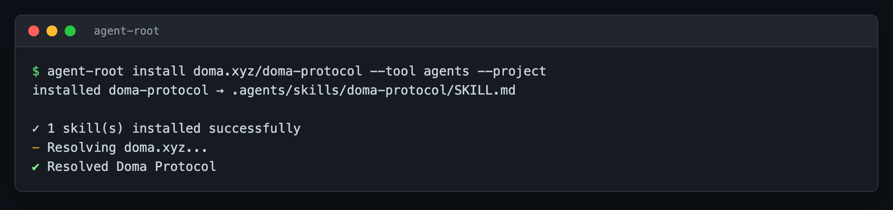
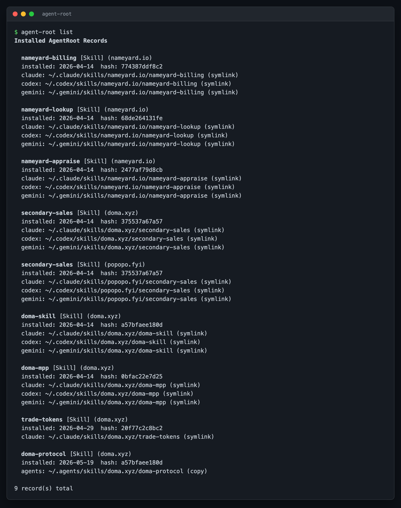
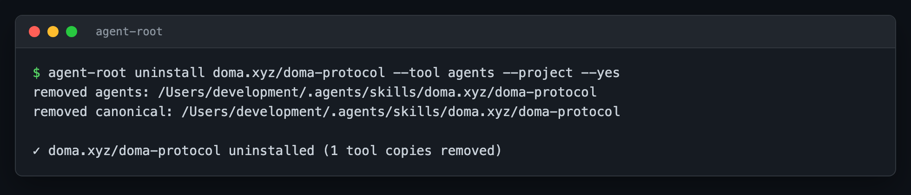
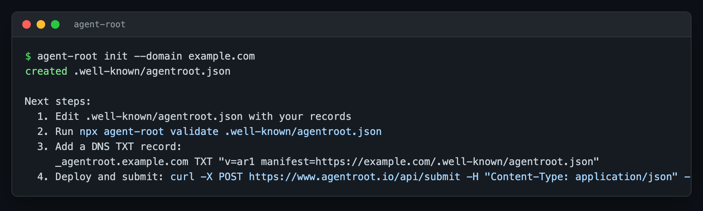
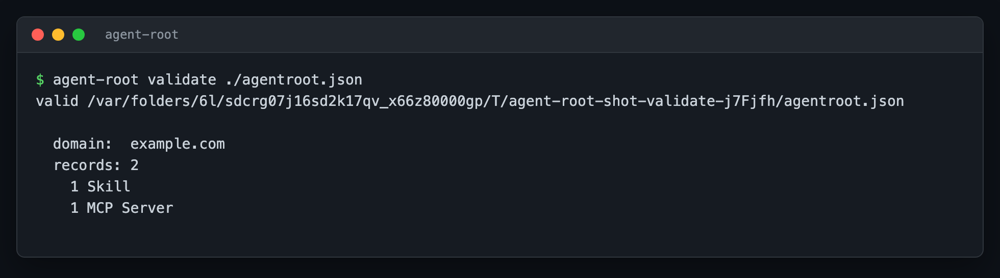

# agent-root

[](https://www.npmjs.com/package/agent-root)
[](LICENSE)
[](https://nodejs.org/)
[](https://github.com/d3-inc/agentroot/actions/workflows/ci.yml)

The command-line client for the **AgentRoot protocol**. Resolve domains to discover AI capabilities, search the public registry, and install skills, MCP servers, and agents directly into Claude, Cursor, Codex, Gemini, or any AI tool that reads from your project directory.



## Table of contents

- [What is AgentRoot?](#what-is-agentroot)
- [What you can do with this CLI](#what-you-can-do-with-this-cli)
- [Install](#install)
- [Help](#help)
- [Usage](#usage)
  - [Discover what a domain publishes](#discover-what-a-domain-publishes)
  - [Search the registry](#search-the-registry)
  - [Install a skill into your project](#install-a-skill-into-your-project)
  - [Manage what you have installed](#manage-what-you-have-installed)
  - [Publish your own manifest](#publish-your-own-manifest)
  - [Browse, stats, and submit](#browse-stats-and-submit)
- [How it works](#how-it-works)
- [Configuration](#configuration)
- [Documentation](#documentation)
- [Contributing](#contributing)
- [License](#license)

## What is AgentRoot?

AgentRoot is a discovery protocol for AI capabilities, modeled on DNS. Any domain owner can publish four kinds of records:

| Record type | Purpose |
|---|---|
| `skill` | Markdown `SKILL.md` files that teach AI assistants how to perform a task. Think "buy a domain on Doma marketplace", "register a domain", "generate an invoice in Stripe". |
| `mcp` | Model Context Protocol server endpoints that expose tools and resources to AI agents. |
| `agent` | HTTP endpoints that respond to natural-language requests. |
| `a2a` | Agent-to-agent communication endpoints for multi-agent workflows. |

Publication happens entirely through DNS. A domain owner creates one TXT record:

```text
_agentroot.example.com  TXT  "v=ar1 manifest=https://example.com/.well-known/agentroot.json"
```

That TXT record points to a JSON manifest listing the records the domain offers. No central authority, no API keys, no gatekeeping. Anyone with a domain can publish. Anyone with a DNS client can discover.

`agent-root` is the reference CLI for the **consumer** side of this protocol. You use it to find capabilities, install them into your AI tools, and (optionally) publish your own.

The protocol specification and public registry live at [agentroot.io](https://agentroot.io).

## What you can do with this CLI

| You want to | Command | What happens |
|---|---|---|
| Look up a domain's AI capabilities | `agent-root resolve <domain>` | DNS lookup, manifest fetch, list of records |
| Search across every registered domain | `agent-root search <query>` | Ranked results from the public registry |
| Install a skill into your AI tool | `agent-root install <domain>/<recordId>` | `SKILL.md` plus supporting files materialized in your tool's directory |
| List what you have installed | `agent-root list` | Per-record breakdown with tool-specific paths |
| Update a previously installed skill | `agent-root update <domain>/<recordId>` | Re-fetches if upstream changed |
| Remove an installed skill | `agent-root uninstall <domain>/<recordId>` | Files removed, registry entry cleared |
| Scaffold a new manifest to publish | `agent-root init --domain <yours>` | `.well-known/agentroot.json` template written |
| Validate a manifest before publishing | `agent-root validate <file>` | "valid" or a list of specific errors |
| Submit a domain to the public registry | `agent-root submit <domain>` | Triggers DNS verification and indexing |
| See registry totals at a glance | `agent-root stats` | Agent/skill counts, by-TLD breakdown |
| Confirm the registry is up | `agent-root health` | `status: ok`, `db: connected`, exits non-zero if not |
| Browse every registered manifest | `agent-root manifests` | Paginated list with domain, manifest URL, record counts |
| Browse curated collections | `agent-root collections` | List collections or open one by slug |
| Inspect or change CLI configuration | `agent-root config get` / `set` | Current settings |

## Install

```bash
# One-off, no install required
npx agent-root <command>

# Or install globally
npm install -g agent-root

# Verify
agent-root help
```

Requires Node.js 18 or later. Works on macOS, Linux, and Windows.

## Help

The full help screen, available at any time with `agent-root help`:



```text
USAGE
  npx agent-root <command> [options]

DISCOVER
  resolve  <domain>[/<record-id>]  DNS lookup, fetch manifest, show records
  search   <query>                  Search the AgentRoot registry

INSTALL
  install   <domain>/<record-id>    Install a record (skill or MCP)
  list                              Show installed records
  update    <domain>/<record-id>    Re-fetch from source
  uninstall <record-id>             Remove an installed record

PUBLISH
  init     [path]                   Scaffold a manifest
  validate [path]                   Validate a manifest
  submit   <domain>                 Submit a domain to the public registry

REGISTRY
  stats                             Registry counts (agents, skills, by TLD)
  health                            Probe the registry API
  manifests [--query <q>]           List registered manifests (paginated)
  collections [<slug>]              Browse curated collections

OPTIONS
  --tool <name>    Target tool: claude, codex, gemini, cursor, agents
  --type <type>    Filter by record type: agent, mcp, skill, a2a, payment
  --project        Install to project directory (not global)
  --all            Install all records (or fetch every search/manifests page)
  --page <N>       Page number for search/manifests (1-indexed, default 1)
  --limit <N>      Per-page limit (1..100, default 20)
  --json           Output as JSON
  --domain <name>  Domain name for init template
  --query <q>      Free-text filter for manifests
  --manifest-url   Explicit manifest URL for submit
  --yes            Auto-confirm all prompts (for CI/scripts)
  --force          Overwrite existing files
  --no-install     Skip auto-install when resolving skill= records
```

Run `agent-root <command> --help` for command-specific flags.

## Usage

### Discover what a domain publishes

The protocol's core operation. Pass a domain, get back its AI capabilities.

```bash
agent-root resolve doma.xyz
```

```text
✔ Found 5 record(s) at doma.xyz

  Doma Protocol (Skill)
  address: doma.xyz/doma-protocol
  desc:    Trade tokens, bridge assets, manage DNS records and nameservers, ...
  skill_md: https://doma.xyz/.agents/skills/doma-protocol/SKILL.md

  Doma MPP Domain Registration (Skill)
  address: doma.xyz/doma-mpp
  desc:    Register domains via the Doma MPP API using the Machine Payments ...
  ...
```

Resolve a specific record by adding the record ID:

```bash
agent-root resolve doma.xyz/doma-protocol
```

Use `--json` for machine-readable output:

```bash
agent-root resolve doma.xyz --json | jq '.records[].address'
```

Use `--no-install` if you want to inspect a `skill=` shorthand record without auto-installing it.

### Search the registry

Use this when you do not know which domain publishes what you need. Search hits the public registry, which indexes every domain that has been submitted at [agentroot.io/submit](https://agentroot.io/submit).

```bash
agent-root search doma
agent-root search "register domain" --type skill
agent-root search marketplace --type agent
```



Type filters: `agent`, `mcp`, `skill`, `a2a`, `payment`. Results are paginated (20 per page by default). Use `--page` and `--limit` to walk longer result sets, or `--all` to fetch every page in one shot (capped at 1000 results):

```bash
agent-root search doma --page 2 --limit 50
agent-root search doma --all --type skill
```

For machine-readable output, `--json` returns the full pagination envelope (`results`, `total`, `page`, `pages`, `limit`) so scripts can drive the loop:

```bash
agent-root search doma --json | jq -r '.results[] | select(.type=="skill") | .address'
agent-root search doma --json | jq '.total, .pages'
```

### Install a skill into your project

This is where the protocol pays off. Pick a record, point `--tool` at your AI assistant, and the CLI does the rest: fetches the `SKILL.md`, fetches every supporting file referenced inside it, and writes everything to the directory your tool reads from.

```bash
cd your-project
agent-root install doma.xyz/doma-protocol --tool agents --project
```



After the install, the SKILL.md and its supporting files are present in the directory your AI tool expects. Open Claude (or Cursor, Codex, Gemini, etc.), start a conversation, and the skill is available.

#### Supported AI tools

`--tool` accepts:

| Value | Install location (global) | Install location (`--project`) |
|---|---|---|
| `claude` | `~/.claude/skills/` | `.claude/skills/` |
| `cursor` | `~/.cursor/skills/` | `.cursor/skills/` |
| `codex` | `~/.codex/skills/` | `.codex/skills/` |
| `gemini` | `~/.gemini/skills/` | `.gemini/skills/` |
| `agents` | `~/.agents/skills/` | `.agents/skills/` |

Use `agents` (the default if you omit `--tool`) when you want a single install that any AgentRoot-aware tool will pick up. Use a tool-specific value when you only want one tool to see the skill.

#### Project vs user install

| Flag | Where files go | When to use |
|---|---|---|
| (no flag) | Your home directory's tool folder | Skills you want available in every project |
| `--project` | The current directory's tool folder | Skills you want versioned with one specific project |

#### Installing every record from a domain

If a domain publishes several skills you all want:

```bash
agent-root install doma.xyz --all --tool agents
```

#### Discovering and installing in one flow

A common workflow: you know roughly what you need but not where to find it.

```bash
# Step 1: search
agent-root search "domain registration" --type skill

# Step 2: install the one you want
agent-root install doma.xyz/doma-mpp --tool claude --project

# Step 3: confirm
agent-root list
```

Running `agent-root search` interactively (without `--json` and inside a TTY) also offers an "install this record?" prompt at the end, so you can do it in one shot.

### Manage what you have installed

```bash
agent-root list
agent-root list --json
```

`list` reads `~/.agentroot/installed.json` and prints every record installed on this machine, with the tool-specific paths each one lives at:



For very large install lists, pipe to `less` or use `--json` to filter with `jq`.

To re-fetch a previously installed record (useful when the publisher has updated the SKILL.md):

```bash
agent-root update doma.xyz/doma-protocol
```

To remove a record:

```bash
agent-root uninstall doma.xyz/doma-protocol --yes
```



`--yes` skips the confirmation prompt. Without it, you get an interactive confirmation.

### Publish your own manifest

Three steps to publish AI capabilities on your domain.

#### 1. Scaffold a manifest

```bash
agent-root init --domain mycompany.com
```

This writes `.well-known/agentroot.json` with a starter record you can edit. The full schema is documented at [agentroot.io/docs/protocol](https://agentroot.io/docs/protocol).



#### 2. Validate before serving

```bash
agent-root validate .well-known/agentroot.json
```



If validation fails, the error message identifies the offending record and field:

```text
invalid agentroot.json

  - records[1]: mcp record missing "transport"
```

Fix the indicated field and run `validate` again until it reports `valid`.

#### 3. Add the DNS TXT record

On your DNS provider, create:

```text
_agentroot.mycompany.com  TXT  "v=ar1 manifest=https://mycompany.com/.well-known/agentroot.json"
```

Serve the JSON file at the URL listed above. Anyone resolving `mycompany.com` with `agent-root resolve` (or any other AgentRoot client) will now discover your records.

#### 4. Submit to the public registry

Once DNS is live and serving the manifest, register the domain with [agentroot.io](https://agentroot.io) so it shows up in `agent-root search`:

```bash
agent-root submit mycompany.com
```

The CLI does a local DNS probe first, then posts to `/api/submit`. If the registry can verify the TXT record, it indexes the manifest and reports the records it found:

```text
✔ Found and indexed: _agentroot, _skill records for mycompany.com

  manifest: https://mycompany.com/.well-known/agentroot.json
  indexed:  5 record(s)
  found:    _agentroot, _skill
```

If DNS is not set up yet, `submit` prints the exact TXT record to add and exits non-zero so CI scripts fail loudly:

```text
✖ No _agentroot TXT record found for mycompany.com

  Add this DNS TXT record, then re-submit:

    host:  _agentroot.mycompany.com
    type:  TXT
    value: v=ar1 manifest=https://mycompany.com/.well-known/agentroot.json
```

Pass `--manifest-url` to skip the DNS probe and submit a known URL directly. Use `--json` to consume the structured response (validation errors, instructions block, indexed records).

### Browse, stats, and submit

Quick reads against the registry that mirror what the web UI shows.

#### Registry stats

```bash
agent-root stats
```

```text
  Agents
    total:   1
    active:  1
    pending: 0
    failed:  0

  Skills
    total:   1338
    active:  1338
    items:   1341

  By TLD
    .ai: 1
```

`--json` returns the same payload the UI's overview cards consume.

#### Health check

```bash
agent-root health
```

Prints `status: ok` and `db: connected` when the registry is reachable. Exits non-zero otherwise, so you can use it as a CI gate:

```bash
agent-root health && deploy
```

#### Browse every registered manifest

`agent-root manifests` walks `/api/manifests` with the same pagination flags as `search`:

```bash
agent-root manifests --query doma
agent-root manifests --page 2 --limit 50
agent-root manifests --all --type mcp
```

Each row shows the domain, current verification status, the manifest URL, a breakdown of records by type, and the last verified date:

```text
  1. doma.xyz [active]
     manifest: https://doma.xyz/.well-known/agentroot.json
     records:  payment=1, skill=4
     verified: 2026-05-19

  Page 1 of 280 (showing 5 of 1399 manifests)
  next: agentroot manifests --query doma --page 2
```

#### Curated collections

The registry publishes editorial collections (e.g. `featured-domains`). List them or open one by slug:

```bash
agent-root collections
agent-root collections featured-domains
```

Both forms accept `--json` for scripting.

## How it works

`agent-root` is DNS-first. It speaks the protocol directly, without depending on any central registry.

**When you run `agent-root resolve example.com`:**

1. The CLI issues a DNS TXT query for `_agentroot.example.com`
2. It parses the returned TXT record for the `manifest=...` URL
3. It fetches the manifest JSON over HTTPS
4. It parses each record and lists it

**When you run `agent-root install example.com/some-skill`:**

1. Steps 1 to 3 above (or a fallback to the registry API if DNS resolution fails)
2. For the named record, the CLI fetches `SKILL.md` and any supporting files referenced inside it (relative URLs are resolved against the SKILL.md location)
3. Files are written to a canonical store at `~/.agents/skills/<domain>/<record-id>/`
4. For each `--tool` you pass, a symlink (or a copy with `--project`) is created in that tool's expected location

**When you run `agent-root search query`:**

1. The CLI hits the registry's paginated `/api/records` endpoint (the same one the web UI uses) with the query, optional type filter, page, and limit
2. If page 1 came back empty, it falls back to `/api/find-skills` (legacy, skill-only)
3. If still nothing and the query is a bare keyword, it treats it as a domain by appending `.io` then `.com` and looks up the manifest directly

The public registry at [agentroot.io](https://agentroot.io) is a convenience for `search`, `stats`, `health`, `manifests`, `collections`, and `submit`, not a dependency for the core protocol. `resolve`, `install`, `update`, and `uninstall` all work even if the registry is offline, because they go through DNS.

## Configuration

Configuration lives at `~/.agentroot/config.json`. Inspect or change it with:

```bash
agent-root config get
agent-root config set api-url https://www.agentroot.io
```

Override the API base at runtime with the `AGENTROOT_API_BASE` environment variable:

```bash
AGENTROOT_API_BASE=https://my-mirror.example.com agent-root search billing
```

No API key is required. The endpoints the CLI calls are public-read (`/api/records`, `/api/manifests`, `/api/manifests/{domain}`, `/api/find-skills`, `/api/stats`, `/api/health`, `/api/collections`, `/api/collections/{slug}`) plus one public-write (`/api/submit`, which the registry verifies via DNS before indexing).

## Documentation

- **Protocol specification**: [agentroot.io/docs/protocol](https://agentroot.io/docs/protocol)
- **Contributing guide**: [CONTRIBUTING.md](CONTRIBUTING.md)
- **Security policy**: [SECURITY.md](SECURITY.md)
- **Support channels**: [SUPPORT.md](SUPPORT.md)
- **Maintainers**: [MAINTAINERS.md](MAINTAINERS.md)
- **Testing recipe**: [TESTING.md](TESTING.md)

## Contributing

Contributions are welcome: bug reports, fixes, documentation improvements, new commands, new flags, new tool integrations. See [CONTRIBUTING.md](CONTRIBUTING.md) for the development setup, test workflow, and PR checklist.

## License

[MIT](LICENSE) © D3 Inc and AgentRoot contributors.
